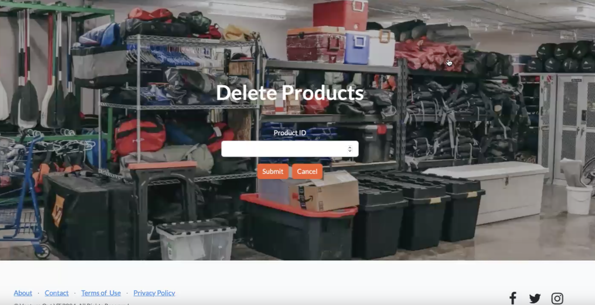
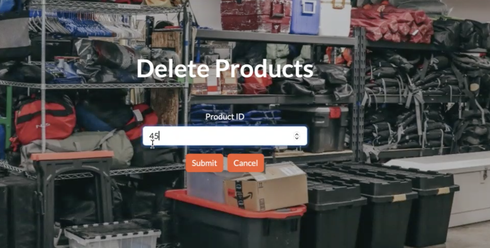
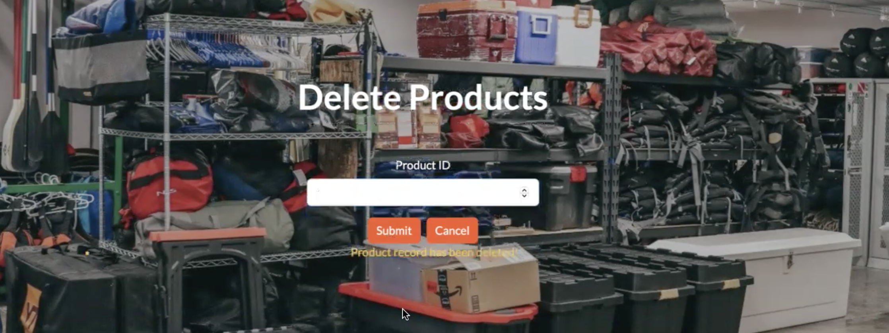

## Here are the pages that allow you to delete individual rental inventory produdcts.

---

### Delete Product Homepage:  

This is the landing page when the toolbar or hyperlinked "Delete Products" is clicked on the previous page. Here, you input a ProductID, and the system removes that product from the inventory database.

--- 

### Delete Product:

Submitting this Product ID produces a confirmation note, and deletes that product from the system.

---

### Inventory Update Confirmation:

A note appears at the bottom of the submit button to let you know that a product record has been removed successfully. The slot then empties, and you can delete more records.

---

Author: Meg Danahy
