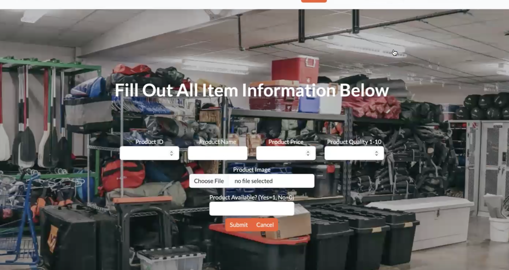
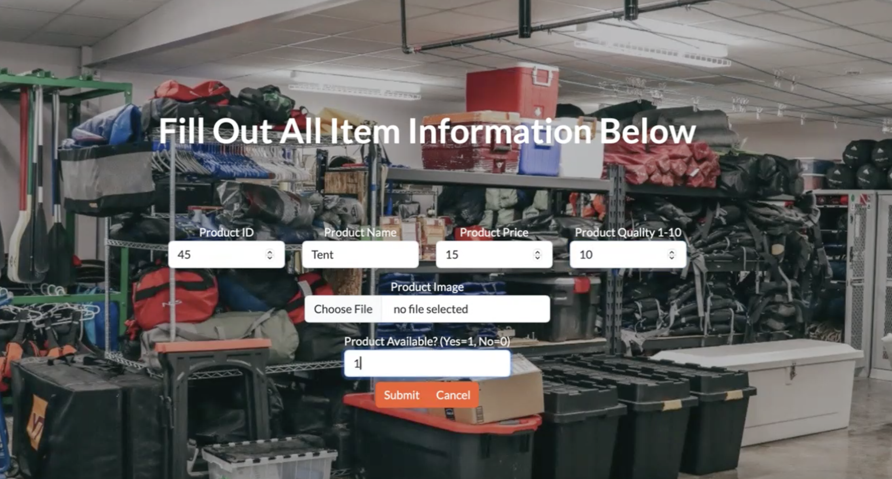
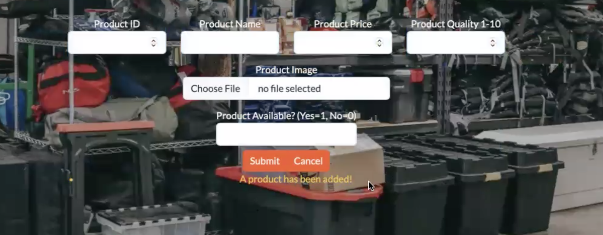
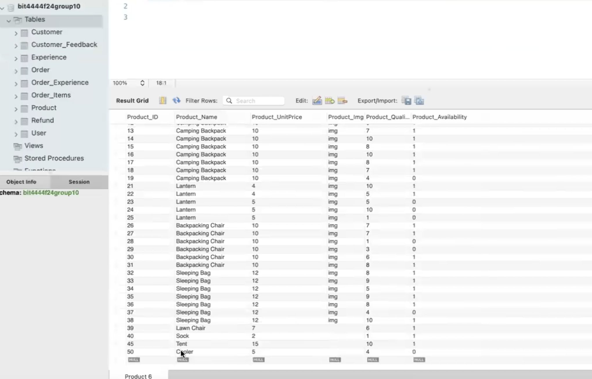

## Here are the pages that allow you to modify the rental inventory in different ways

### Modify Inventory Homepage:  

This is the landing page when the toolbar or hyperlinked "Modify Inventory" is clicked on the previous page.

### Inventory Update:

To update the inventory, you fill in the rental item's information in these slots. If it's primary key (ProductID) is new, it will insert a new item. If it's a reoccuring ProductID, it will update the database.

### Inventory Update Confirmation:

A note appears at the bottom of the submit button to let you know that a product has been added successfully. The slots then empty, and you can add more products.

### MySQL Database Updating:

This is the updated SQL database, you can see there is a new item with ProductID 45, as was submitted on the previous page. 

---

Author: Meg Danahy
