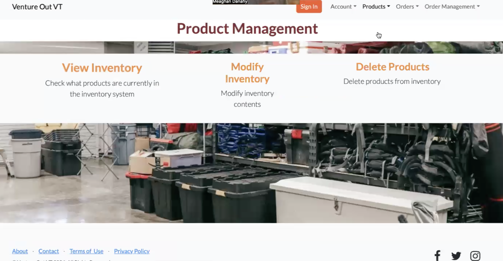

# VentureOut Web App

A web project built for **Venture Out**, Virginia Tech’s outdoor recreation program, to manage gear rentals and bookings.
I was responsible for creating rental inventory and product management pages.

---

## 🖼️ Screenshot to Begin:

Product Management Landing Page:  

From here, you're able to navigate to the Modify Product page, the View Inventory page, or the Delete Product page.

→ Modify Product
→ View Inventory
→ Delete Product

---

## 📝 Description

This project is a prototype of a web application for managing outdoor equipment reservations and event registration. It includes:

- HTML pages showing main workflows
- Screenshots of app interface
- Notes on intended functionality and future improvements

---

## ⚙️ How to View

1. View screenshots in the repo if you want a quick preview.
2. Clone or download the repo.  
3. Open any `.html` file in your browser. 

---

## 🔮 Future Improvements

- Download the full project individually for actual use.
- Connect to a terminal that allows the pages to act as a website.

---

## 👩‍💻 Author

Meaghan Danahy – [LinkedIn](https://www.linkedin.com/in/meaghandanahy/)
