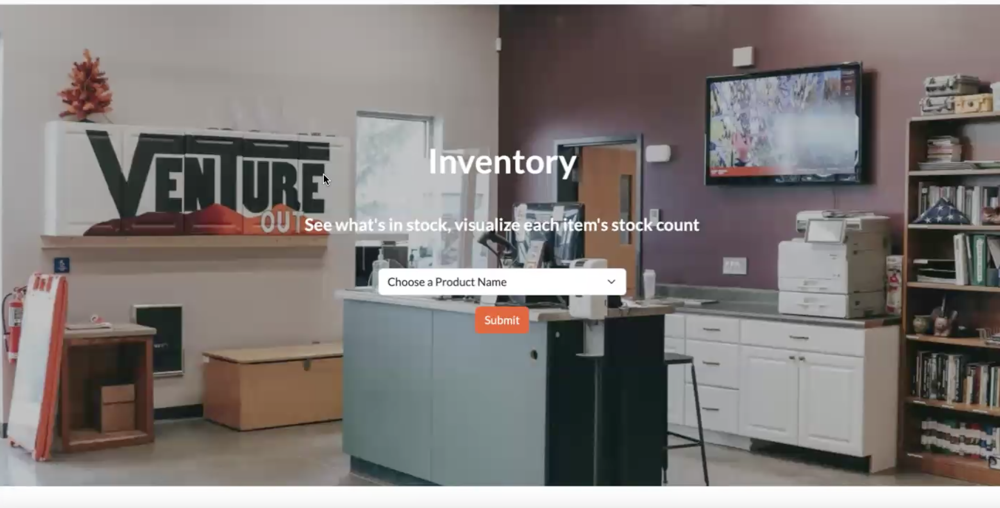
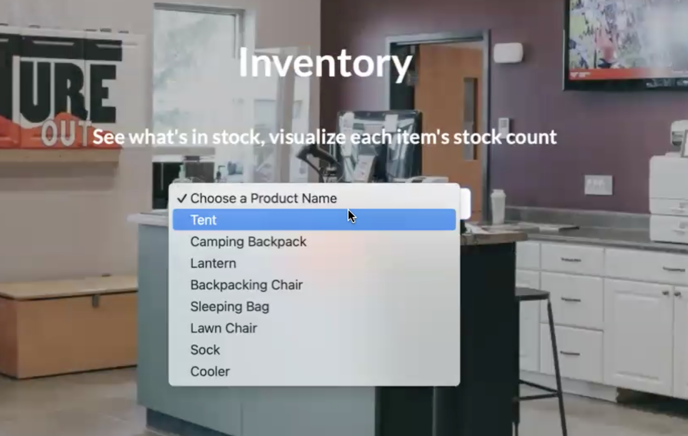
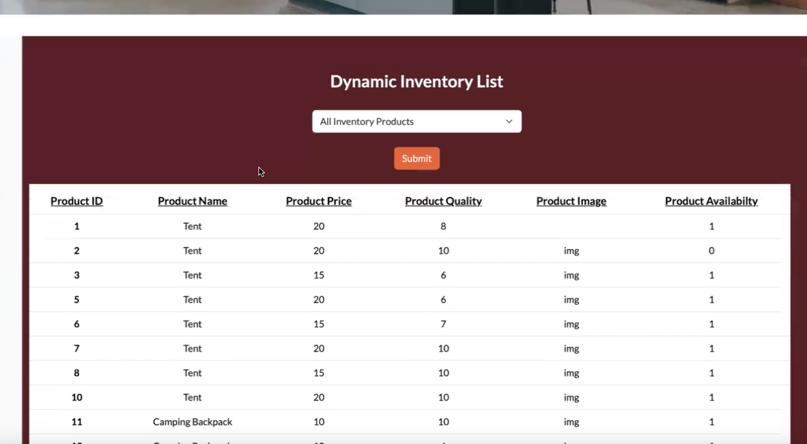
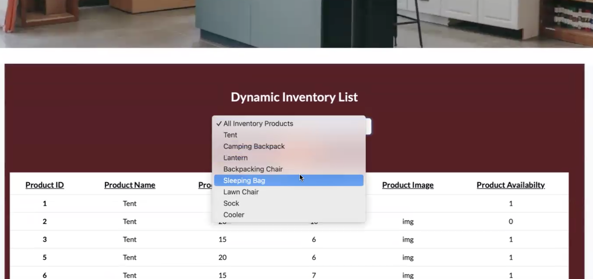

## Here are the pages that allow you to view inventory in different ways

###View Inventory Homepage:  

This is the landing page when the toolbar or hyperlinked "View Inventory" is clicked on the previous page.

### Inventory Dropdown:

This dropdown allows you to select a rental item type, and brings you to a page that shows the explicit amount of items there are under that name.

### Dynamic Inventory Database:

Upon scrolling down you'll find a table of all rental items we have in our database that updates dynamically as the database is edited. It also updates if you select a certain kind of item from the dropdown selection.

### Dynamic Inventory Dropdown:

If I click on sleeping bag, the table repopulates with only sleeping bags, allowing me to see what we have available.

Booking Page:  

